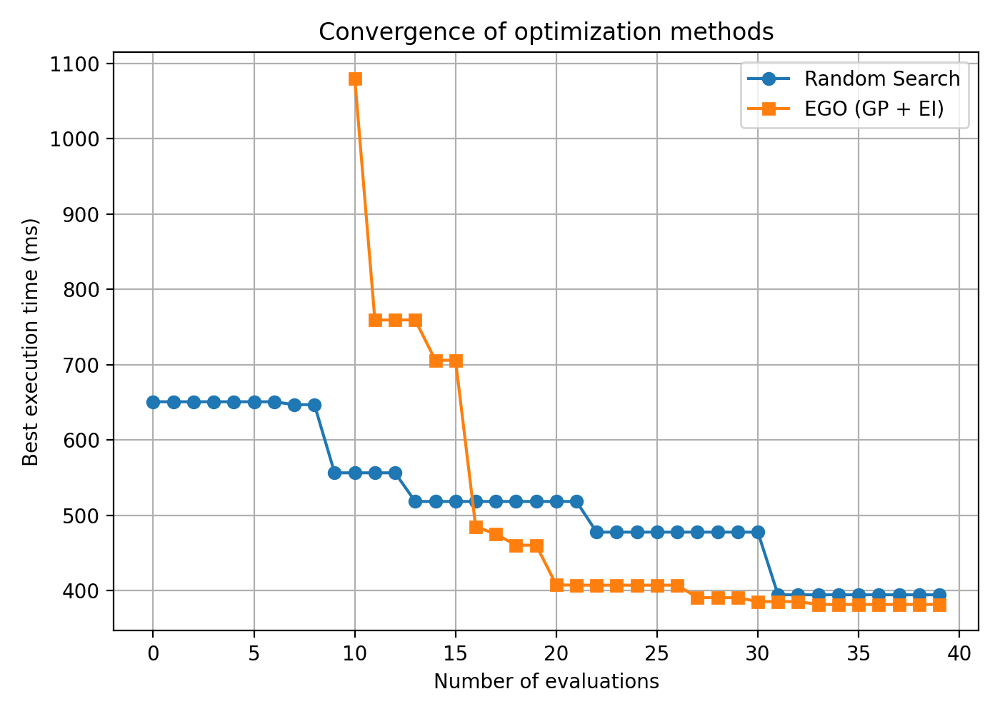

# Random Search と EGO（Gaussian Process）による探索性能比較

本実験では、行列積カーネルの性能チューニング問題を対象として、  
**Random Search** と **EGO（Efficient Global Optimization, GP ベース）** の探索性能を比較した。

---

## 1. 最適化対象

対象とする計算は、行列積

\[
C = AB
\]

であり、その実装において以下のパラメータを探索変数とする。

- **ブロッキング（タイル化）サイズ**
  - \(B_M\)：出力行列の M 方向タイルサイズ
  - \(B_N\)：出力行列の N 方向タイルサイズ
  - \(B_K\)：積和計算における K 方向タイルサイズ
- **ループアンローリング係数**
  - \(U\)：内側ループ（K 方向）のアンローリング係数
- **並列スレッド数**
  - \(T\)：CPU 並列実行時のスレッド数

これらのパラメータはすべて **離散値** とし、有限な候補集合から選択する。

目的関数は、これらのパラメータを用いた行列積カーネルの  
**実行時間（実測値）を最小化すること**である。

---

## 2. 実装構成

本実験は以下の 3 つのファイルで構成される。

### `matmul_block_unroll.cpp`
- ブロッキングおよびループアンローリングを用いた行列積の C++ 実装
- 指定されたパラメータに基づいて行列積を実行
- 実行時間を計測し、標準出力として返す
- コンパイル時には最適化オプション（例：`-O3`）を使用

---

### `run_matmul.py`
- C++ 実装（`matmul_block_unroll.cpp`）を Python から呼び出すラッパースクリプト
- 探索空間（\(B_M, B_N, B_K, U, T\) の候補集合）を定義
- 指定されたパラメータに対して行列積を実行し、実行時間を取得
- 実行ごとのばらつきを抑えるため、複数回実行した中央値を評価値として用いる

---

### `search.py`
- 探索アルゴリズムの本体
- 以下の 2 手法を実装し、探索性能を比較する
  - **Random Search**
  - **EGO（Gaussian Process + Expected Improvement）**
- 各手法について探索履歴を保存し、結果を可視化

---

## 3. 探索手法

### 3.1 Random Search
- 探索空間からランダムにパラメータを選択
- 離散・非連続・ノイズを含む目的関数に対して仮定を持たずに探索可能
- 広い探索空間を一様に探索できる点が特徴

---

### 3.2 EGO（Gaussian Process）
- 探索済みの点を用いてガウス過程（GP）によるサロゲートモデルを構築
- 各未探索点に対して **Expected Improvement（EI）** を計算
- EI が最大となる点を次に評価することで、探索と活用のバランスを取る

本実験では、離散パラメータを正規化した連続特徴量として扱い、  
**有限な候補集合上で EI を全探索する形で EGO を適応**した。

---

## 4. 結果の可視化

探索結果は以下の図として可視化した。

- 横軸：評価回数（探索ステップ）
- 縦軸：それまでに得られた最良の実行時間（best-so-far）
- Random Search と EGO の収束挙動を比較

